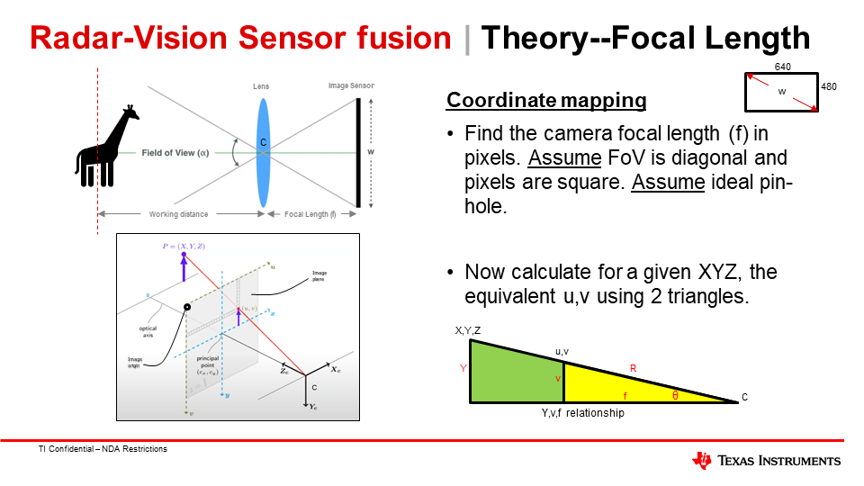

# Detailed Demo Description

Here we'll give a more detailed view of the radar-vision portion of this demo. Topics related to the typical [edgeai-gst-apps](https://github.com/TexasInstruments/edgeai-gst-apps) code / framework will not be addressed. 

Thus, this page focuses on acquiring radar pointclouds (UART transfer + parsing), projecting onto image from camera, and estimating distance of people using vision and radar information.

## Pointcloud acquisition 

Data from the radar is acquired over UART from [radar_acquisition.py](../apps_python/radar/radar_acquisition.py). 

### Configure UART and acquire data

UART is passed from the IWR6843 AOP EVM board through USB, which populates two UART ports 

There are two ports populated for User (115200 baud) and Data (921600 baud). In most operating systems, these will populate such that User port has a lower index than Data port. 
* On Windows, COM0 for user, COM1 for Data
* On Linux (including Processor SDK), /dev/ttyUSB0 and /dev/ttyUSB1 for User and Data, respectively

Configuration data is passed through the User (or Command Line) port. This is a read from a [.CFG file](../apps_python/radar/IWR6843AOP-configs/baseline-AOP-people-detection.cfg) and sent over the User port. The contents of this CFG file are based on the [mmWave Sensing Estimator Tool](https://dev.ti.com/gallery/view/mmwave/mmWaveSensingEstimator/ver/2.4.0/), but may produce configurations that are not compatible with the firmware available under [radar-firmware](../radar-firmware/).

Note that the configuration passed in this demo has a sampling rate of 6 Hz, based on the 150.00ms value in frameCfg of the CFG file.

After configuration data is sent via the User port, data should start to arrive over the Data port. This will by in a TLV (type, length, value) format. 

### Parse UART (TLVs) for pointclouds

Reference within Radar Toolbox: https://dev.ti.com/tirex/explore/node?a=1AslXXD__2.20.00.05&node=A__ADnbI7zK9bSRgZqeAxprvQ__radar_toolbox__1AslXXD__2.20.00.05
* Documentation/Software Guides/ Understanding UART Data Output Format

Pointclouds will arrive with a specific 'type' that indicates the format of the arriving data, for example, compressed pointclouds. The raw bytes are parsed and converted into floating-point valued point clouds, describing the distance from the mmWave radar chip to the detected reflection. 

The 3D points in this point cloud will each have a X,Y,Z, and doppler value. Distances are in meters, and doppler is a velocity in meters per second (>0 is movement away, <0 is movement towards the chip)
* X is left (negative) and right (positive)
* Y is distance in front of the radar, and is always positive
* Z is elevation -- up is positive, down is negative

Note that this coordinate system is different than typical image projections, where Z is distance. This demo application will reorder Y and Z to comply with standard axes from the camera's point of view

## Pointcloud projection to image sensor and calibration

A fundamental part of working with imagery and pointclouds simultaneously is to get both data types into the same frame of reference. This entails transforming or projecting a 3D point onto the 2D image plane.

The following resources were used in for development of this pointcloud-projection task, and are quite informative on the theory of this problem:
* https://www.mathworks.com/help/vision/ug/camera-calibration.html
* https://docs.opencv.org/3.4/d9/d0c/group__calib3d.html -- see Detailed Descriptions

### 3D Point Projection --> 2D Image Plane

The goal is to associate 3D points in space with visual features within an image. We have a 3D point, and this needs to be converted into a 2D location (from the camera's perspective) in terms of pixels.

This can be separated into two operations: external and internal calibration between the sensor types. 

All components of pointcloud projection are handled by [pointcloud_projection.py](../apps_python/pointcloud_projection.py), and calibration data is set by a [series of constants](../apps_python/camera_constants.py) 

### External Calibration (extrinsics)

External calibration refers to the physical relationship between the 6D pose (i.e. position and orientation) of the sensors. 

If the radar is slightly above the camera, then the 3D point needs to be translated 'down' to be understand within the camera's coordinate system. Similarly, if the camera and radar are not both pointing in the same direction, the 3D point needs to be 'rotated' into the camera's coordinate system. 

We represent the relation of these sensors with 'extrinsic' information about the world. For simplification, we consider the mmWave radar to be the world coordinate system, and radar points must be shifted into the camera's coordinate system by a translational and rotational operation. These are mitigated by positioning the camera and radar very closely and with minimal angle offset (see our [hardware guide](./hardware_setup.md)), but still benefit from some fine tuning to minimize the difference on higher distance. 

For the purposes of this application, we manually tuned the calibration parameters in [camera_constants.py](../apps_python/camera_constants.py). The result of this calibration is an extrinsics matrix that is used to perform this transform

Note that convention here uses a different set of axes than the pointclouds in radar. Here, for axes (positive-negative): 
* X is right-left, 
* Y is down-up, and 
* Z is forward-backward. 

It is important when transforming points between coordinate systems that the axes used adhere to the right-hand rule. 

### Internal Calibration (intrinsics)

Internal (to the camera) calibration will consider the physical relationship betwen the camera (aka image sensor) size, the focal length, and the image's pixels. This is represented using an intrinsics matrix.

Internal calibration uses the intrinsic matrix to transform the point from a physical location in meters into a X,Y location in pixels. 
* Note that common softwares for image processing like OpenCV consider the Y pixel value to increase in the downward direction. 

Tools like OpenCV have built-in functions for creating an intrinsic matrix from a series of checkerboard images. See the [tutorial from OpenCV](https://docs.opencv.org/4.x/dc/dbb/tutorial_py_calibration.html). This can be used to produce a camera (aka intrinsic) matrix 

Alternatively, a decent intrinsic matrix can be acquired by knowing the physical pixel size (typically in microns), the resolution being captured, and the focal length of the lens. 

#### Lens Distortion
Unless there is substantial distortion on the lens (e.g. wide angle / fisheye), This is probably minimal. Devices like AM62A make use hardware acceleration (Lens Distortion Correction (LDC) within the ISP) for highly distorted lens. There may still be some distortion, and we may need to re-map projected points to match the level of distortion present in the image. 

If distortion is still present (and non trivial to remove), we may need to (effectively) re-distort the 3D points projected onto the camera plane. See the [pointcloud_projection.py](../apps_python/pointcloud_projection.py), which has a structure for implementing this distortion according to OpenCV's mathmatical representation of distortion sources. This function is parameterized by values within [camera_constants.py](../apps_python/camera_constants.py).

### Tuning Calibration

For this demo, tuning was handled manually by modifying translational and rotational parameters in [camera_constants.py](../apps_python/camera_constants.py), and gradually tuning until the results were sufficiently accurate from a visual test. 

To do this, it is helpful to have a consistent reflector, like a corner reflector. If this is pointed at the radar, it will reflect in the same direction  such that multiple strong points will be recognized. The visualized (i.e. projected) points should intersect/cover this reflector in the output images. 

To more calibrate and build the extrinsics using data, a common strategy is to place put a checkerboard image onto a cardboard box (non-reflective for radar) with a corner reflector attached to the back to create a calibration apparatus. 
* Multiple frames (10-20) are captured with the calibration apparatus at different locations, ideally on the same horizontal plane as the radar (i.e., move the setup laterally) because elevational (vertical) resolution of imaging radar is generally less precise than the azimuthal (horizontal) resolution. 
    * When capturing a data point (an image + radar pointcloud), ensure the image and pointcloud are captured at the same time (or at least with no movement during that time period)
    * Multiple 3D points may be captured -- the strongest SNR should correspond to the corner reflector
* Run a sum-of-least-squares algorithm to set the parameters of the extrinsics matrix that map 3D points to the center of the checkerboard, which OpenCV can easily isolate from a clear image.  

## Distance Estimates

FIXME