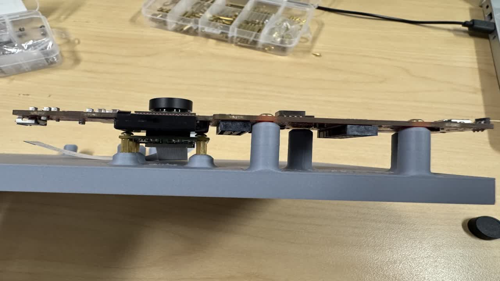

# Hardware setup guide for radar-vision fusion demo

This document is designed to help users replicate the demo exactly with equivalent hardware. This mitigates the need for additional camera-radar [calibration](https://www.mathworks.com/help/vision/ug/camera-calibration.html), which can be challenging especially for the extrinsics that depend on relative positioning of the two sensors.

## Required Hardware

Essentials: 
* [AM62A Starter Kit EVM](https://www.ti.com/tool/SK-AM62A-LP)
* [IWR6483 AOP EVM](https://www.ti.com/tool/IWR6843AOPEVM)
      * Note that the hardware revision does matter w.r.t. the mounting holes. We used rev G. in this demo, which has different hole positioning than legacy rev F. Seek the white text on the EVM to check which revision you have. 
* [IM219 module with manual focus](https://www.amazon.com/dp/B082W4ZSM9)

Mounting hardware:
* Threaded inserts -- M2 and M2.5 size
* 3D printed mounting plate -- [radar_camera_AM62A_rotated v3.stl](../3d-print/radar_camera_AM62A_rotated%20v3.stl)
* M2 and M2.5 screws
* M2 and M2.5 standoffs
* 1/4 inch threaded insert for attaching to standard camera mount

The 3D printable file for the mounting plate is in this repo as [radar_camera_AM62A_rotated v3.stl](../3d-print/radar_camera_AM62A_rotated%20v3.stl)

## Assembly Guide

We will walk through the physical assembly of the hardware. It is recommended to flash the mmwave radar IWR6843 AOP EVM prior to attaching it to the board

### Standoff setup

Recommendations and guidelines
* Threaded inserts are added by applying heat to the standoff such that the 3D printed plastic melts around the insert. A solder iron is the best tool for this
* Attach a standoff to the threaded insert when heat-sinking into the 3D printed mount. Otherwise, melted plastic will enter the threaded insert such that the threading cannot be used
* Make the threaded insert as level as possible, else some screws may not fit or have to be driven at an angle

1) With standoffs attached to the M2 threaded insert, apply heat with a solder iron to insert these around the IMX219 text

Leave the standoffs attached

2)  With standoffs attached to the M2 threaded insert, apply heat with a solder iron to insert these around the IWR6843AOP text

**Strongly recommended **

Remove the standoffs

3)  With standoffs attached to the M2.5 threaded insert, apply heat with a solder iron to insert these around the SK-AM62A text

Remove the standoffs

The mounting plate should look like so: 

4) Optionally, add a 1/4 inch camera mount threaded insert. This is not necessary, but makes it easier to mount the entire setup on a tripod or similar setup.

### Attaching hardware to the mounting plate

* Remove standoffs from all threaded inserts (except the camera) before mounting
* Do not overtighten. The boards should be snug to the mount, but no tighter than is necessary for them to be snug

1) Attach the camera with the CSI2 cable already inserted

Make sure the cable will fit to the EVM. This is typically a 0.5mm 22 ribbon cable

2) Attach the radar IWER6843 EVM

The additional supports should be lightly in contact with the radar. This means standoffs should not be used

3) Plugin the CSI cable to the SK-EVM

4) Attach the SK-EVM to the mounting plate

5) Connect the IWR6843AOP to the AM62A SK-EVM with a micro-usb to USB cable

We use a small cable and hide underneath the EVM to make it look nicer, but this is not required so long as the cable is not in front of the radar or camera.

Once all this is connected together, we can look to software and get this application running!